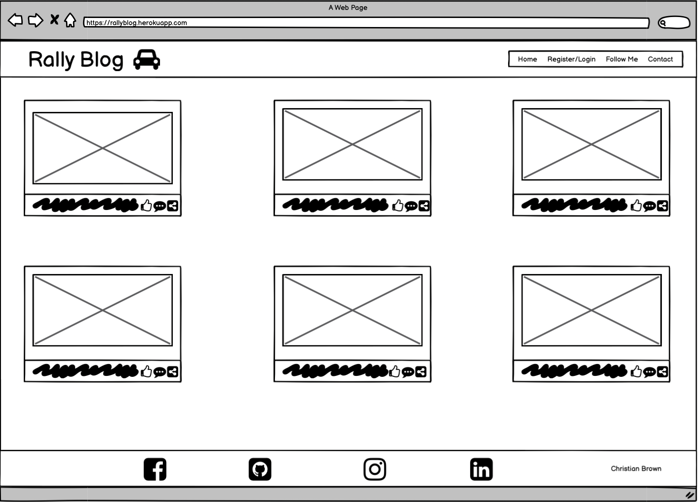
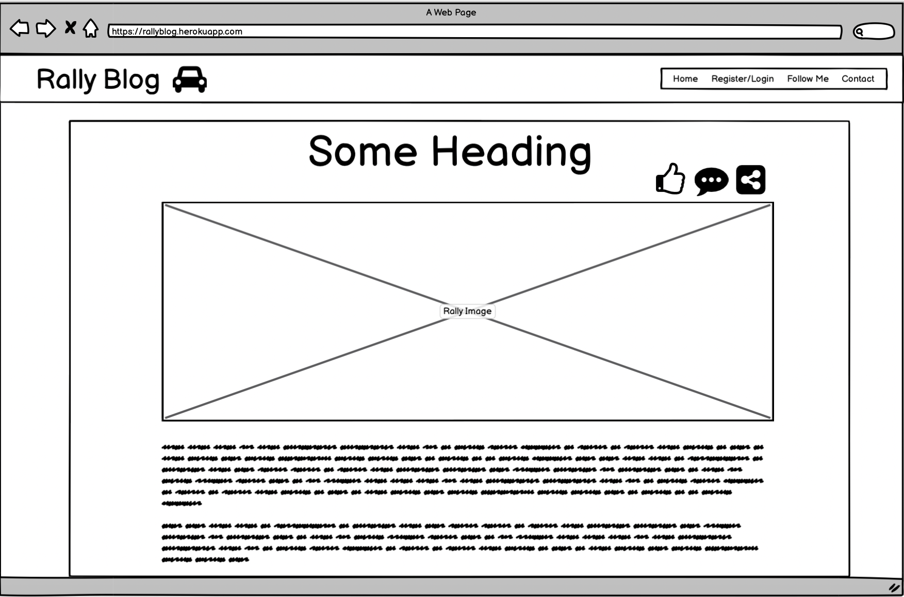
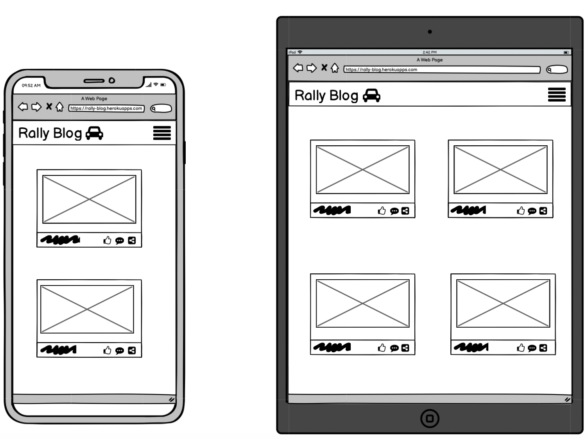
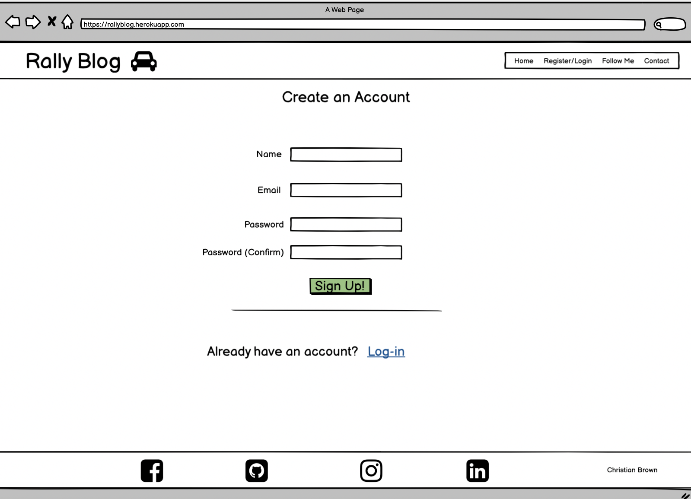
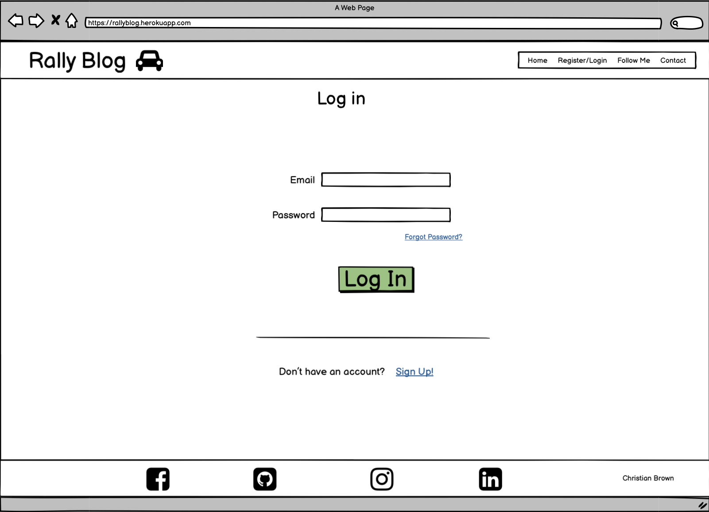
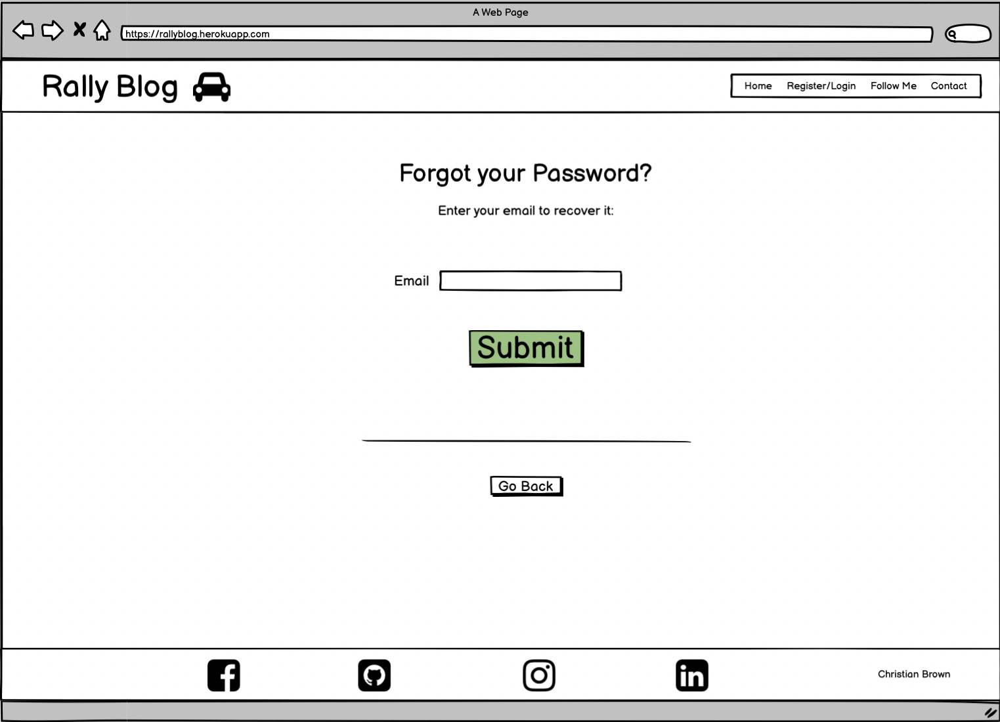
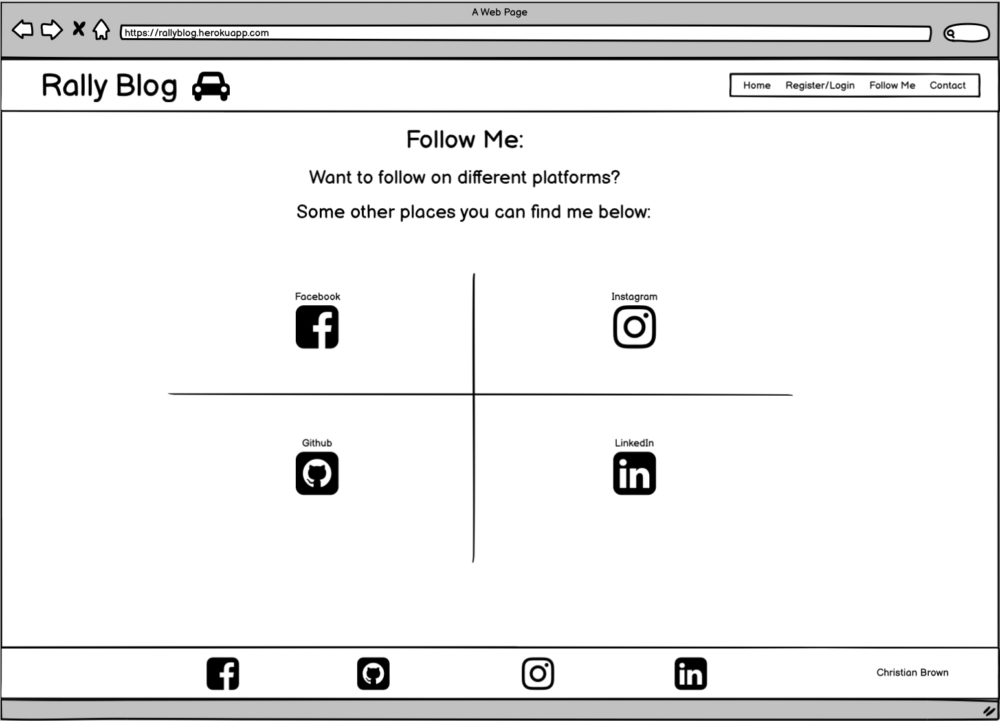
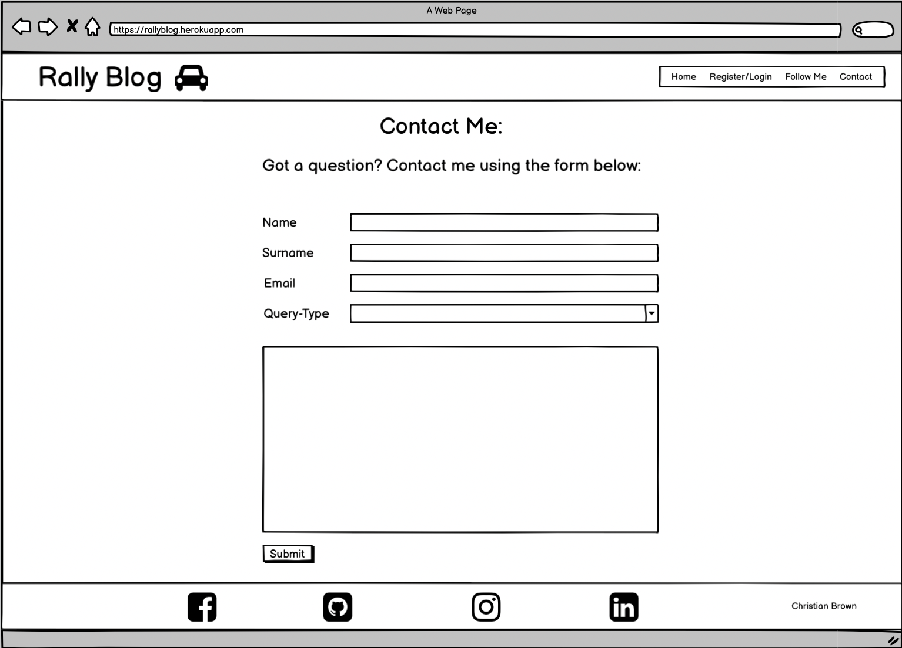
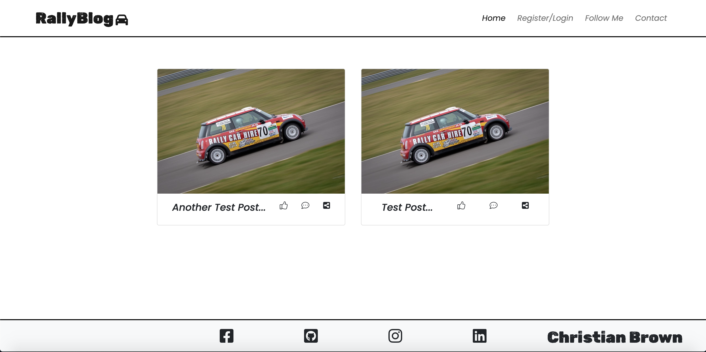
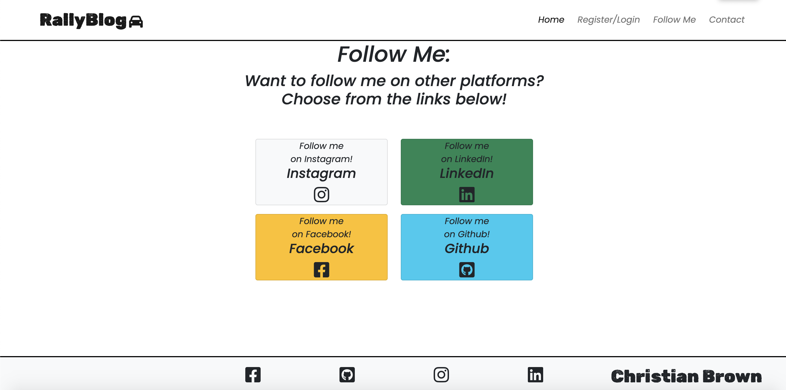

# Rally Blog

The Rally Blog Website is a blog page about my rallying journey starting out as a driver and co-driver in the UK.

This is my first full-stack project, which contains blog posts about different Rally events I attend as a driver, co-driver or supporter. 

The aims of this website are:

1. To document my journey for readers
2. To inspire more people to take an interest in rallying and motorsport
3. To give readers different social media platforms to follow me on
4. To give readers to ability to use a contact form to contact me directly with queires 

As a full stack project, my personal aims out of this are to test my abilities in implementing Django in my fourth portfolio project for Code Institute, and to create a site which I will be eager to maintain and continue posting content on in future.

The website is deployed through Heroku, and the live link can be found here: ##################### 

---
## Website across different platforms

---

## Table of Contents
1. [Wireframes](#wireframes)
2. [User-Stories and Epics](#)
3. [UX Description](#ux-description)
4. [Technologies used](#technologies-used)
5. [Features](#features)
6. [Features to implement](#other-features-to-implement)
7. [Testing and Validation](#testing-and-validation)
8. [Bugs and Issues](#bugs-and-issues)
9. [Peer Reviews](#peer-reviews)
10. [Deployment](#deployment)
11. [Credits](#credits)

# Wireframes

I used Balsamiq to construct my wireframes, as it's a trustworthy way of mapping out my project ideas, which I have used on all of my prior projects as well.

## Home Page

## Open Post

## Different Devices

## Create Account

## Login

## Forgot Password

## Follow Me 

## Contact Page

---

## Early Renderings

After creating my wireframes and getting my work environment set up to point where I was happy to start routing up urls, I decided to trial my templates/views to make sure I was happy with how my wireframes would look in practice.

Here is an example of my rendered home page early on in development:

Here is an early example of my Follow-Me page, which I imagined as a 4 box grid with social media icons inside that, when clicked, direct you to my associated social media pages:

---

# User Stories and Epics

## User Stories:

- 
- 
- 
- 
- 
- 
- 
- 
- 

# Technologies Used

Technologies and Frameworks used to make this website include the following:

- HTML5 
- CSS3
- Javascript (Vanilla and JQuery)
- Python
- Django v3.2 Framework
- Bootstrap v5.0
- Git
- Balsamiq
- Heroku
- Cloudinary
- Github
- Gitpod IDE
- Summernote
- VSCode IDE
- Google Chrome Browser
- PostgreSQL

---

# Features

My Rally Blog website consists of many features, that allow the user to interact with my site in differnt ways.

1. A Nav bar that contains links to:
    - A link that returns the user to the home page
    - A register/login page
    - A social media links page
    - and a contact page with a form to fill out to get in touch

2. A footer that contains font awesome icons with links to:
    - Facebook
    - Instagram
    - LinkedIn
    - Github

3. A Home Page that displays Blog post content which can be individually clicked on to open posts. When opened they display unique content to that specific blog post/article.

4. A Login Page, where users can log into their account. It also gives options to create an account if you don't have one or if you forget your password you can follow a link to reset it.

5. A Register Page, where users can create an account.

6. A Forgot-Password Page, where users can retreive or reset their password. Also gives you options to go back to the Login or Registration pages.

7. A Follow Me page, with cards displaying social media links for the site user to visit and follow me on different social media platforms.

8. A Contact form page, where the site user can fill out a form to get in touch with a particular query they have in mind. The form asks for a name & surname, email, query-type and displays a text area to type out your message.

9. Being a Django site, there is also an admin page just for the site Admin/Author, where the admin can edit, create, delete and draft/publish content. The Admin page allows me to see more than just the content, I can view comments, user registration and contact forms sent to me from the admin panel.

# Features to implement

- 
- 
- 
- 
- 

# Testing and Validation

- 

# Bugs and Issues

- I had an issue/bug where Posts were not displaying on the home page and the debug page that rendered was giving me mixed messages about there the issue was stemming from. After trying to clear the database using `python3 manage.py flush`, and being puzzled by the issue and tryign to find issues in my code for days, I decided to delete my database and and create a new one. I simply then added the new database url to my env.py file and mademigrations and migrated and it worked perfectly again. 

- There were one or two other occasions where it became necessary to delete my database to avoid bugs/issues during development. 

- I had an issue/bug where when developing the functionality of posting a form to the database through the contact page, option 3 (Other) in the select tag dropdown was throwing an error, whereas the other two options were posting to my database just fine. I asked about this on Slack and it was suggested to me by Dave Horrocks and Daisy McGirr that I should try using a CharField instead of a BooleanField, as this was likely causing the issue (as it's looking for values of just 0:False and 1:True) - I deleted any old records in my admin page and went about adjusting the Contact model in question and it worked as expected after making this change.

# Peer Reviews 

- 

# Deployment

- 

# Credits

- Code Institute's Django Cheatsheet was used to help me get my workspace set up, including installing Django and how to create your project and app in the terminal: [C.I Django cheatsheet](https://docs.google.com/document/d/1P5CWvS5cYalkQOLeQiijpSViDPogtKM7ZGyqK-yehhQ/edit)

- Similarly, the idea for a Rally Blog was inspired by a walkthrough called "I think, therefore I blog" by Code Insitute.

- I consolidated and learned much of how to use Python/Django with the Udemy course here, as a significant supplement to the C.I course: [Udemy Django course](https://www.udemy.com/course/django-and-python-full-stack-developer-masterclass/)

- I used Bootstrap's fantastic documentation to help me to create the main sections of my home page, and features on other pages such as the contact form:
    - [Bootstrap Navbars](https://getbootstrap.com/docs/4.1/components/navbar/)
    - [Bootstrap Forms](https://getbootstrap.com/docs/5.0/forms/validation/)
    - [Bootstrap Select](https://getbootstrap.com/docs/5.0/forms/select/)
    - [Bootstrap Cards](https://getbootstrap.com/docs/5.0/components/card/)

-  I learned about field validations for my app models from Geeksforgeeks: [geeksforgeeks](https://www.geeksforgeeks.org/default-django-built-in-field-validation/)

- All images are sourced from me or given to me with full permission to use. All the blog content is written by myself. 

- All icons used came from Font Awesome: [Fontawesome](https://fontawesome.com/)

- Favicons used were sourced from favicon.io: [Racing car Favicons](https://favicon.io/emoji-favicons/racing-car)

- I got inspiration for my follow-me page based on this code example from Bootsnipp: [Bootsnipp](https://bootsnipp.com/snippets/or33d)

- This superb page helped me to clear my migrations during development when I made too many migrations: [simpleisbetterthancomplex](https://simpleisbetterthancomplex.com/tutorial/2016/07/26/how-to-reset-migrations.html)

- Some great tutorials/sources used for inspiration for my contact form/page:
    - [A designer who codes](https://www.youtube.com/watch?v=aeNDvQi6O94)
    - [djangotutorials](https://www.youtube.com/watch?v=-qAf_Qx6Ygg)
    - [learningaboutelectronics](http://www.learningaboutelectronics.com/Articles/How-to-insert-data-into-a-database-from-an-HTML-form-in-Django.php)

- Colour codes:
    - Instagram purple: [Instagram colour](https://www.designpieces.com/palette/instagram-new-logo-2016-color-palette/)
    - Facebook: [Facebook colour](https://usbrandcolors.com/facebook-colors/)
    - Linkedin: [Linkedin colour](https://encycolorpedia.com/0e76a8#:~:text=The%20hexadecimal%20color%20code%20%230e76a8,%25%20green%20and%2065.88%25%20blue.)
    - Github: [Github colour](https://encycolorpedia.com/171515)

- Instructions on how to install Django Extensions: 
    - [Installation](https://django-extensions.readthedocs.io/en/latest/installation_instructions.html)
    - [Using AutoSlugField](https://django-extensions.readthedocs.io/en/latest/field_extensions.html)

---

[Return to Top of Page](#rally-blog)