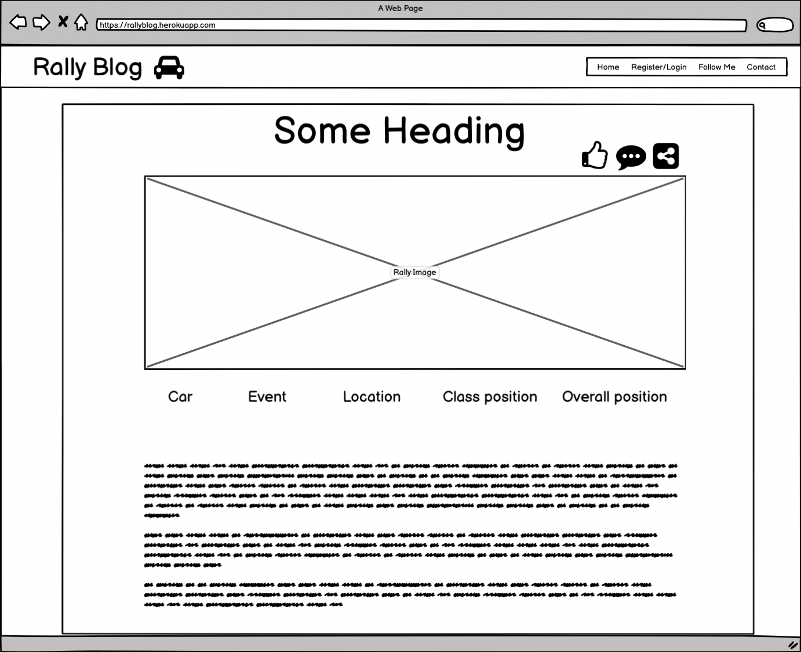
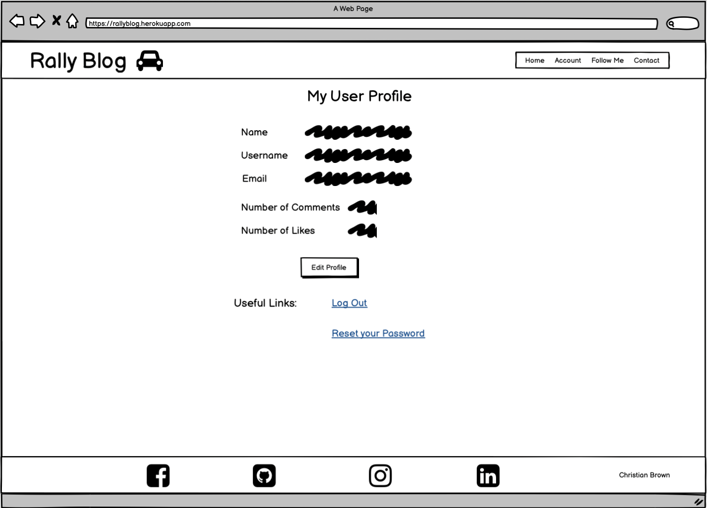
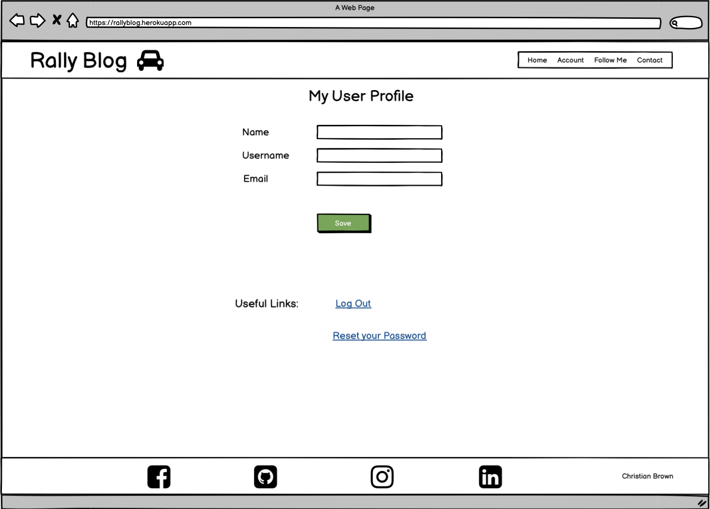
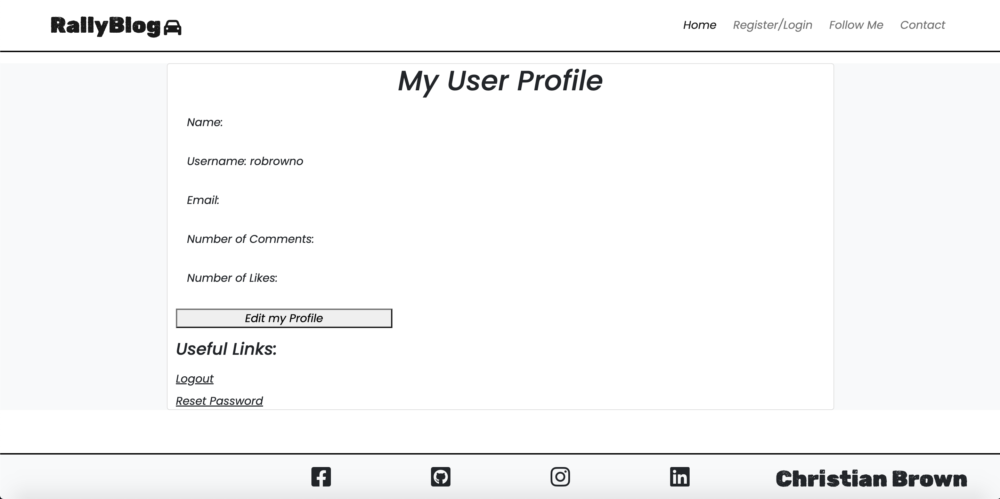
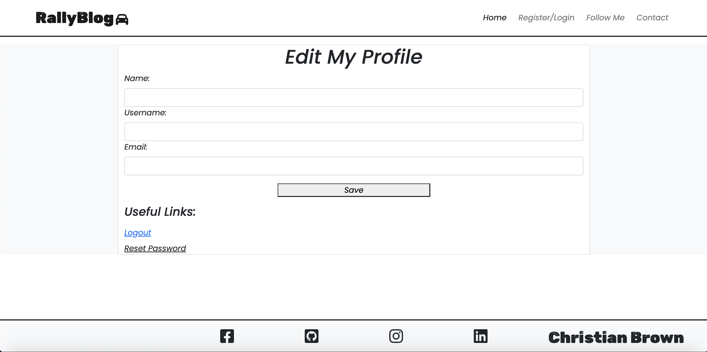
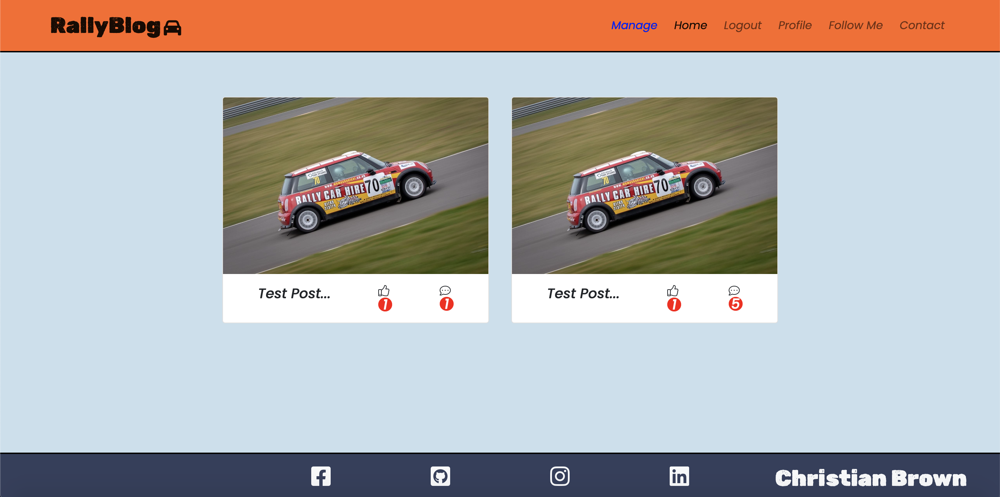

# Rally Blog

The Rally Blog Website is a blog page about my rallying journey starting out as a driver and co-driver in the UK.

This is my first full-stack project, which contains blog posts about different Rally events I attend as a driver, co-driver or supporter. 

The aims of this website are:

1. To document my journey for readers
2. To inspire more people to take an interest in rallying and motorsport
3. To give readers different social media platforms to follow me on
4. To give readers to ability to use a contact form to contact me directly with queires 

As a full stack project, my personal aims out of this are to test my abilities in implementing Django in my fourth portfolio project for Code Institute, and to create a site which I will be eager to maintain and continue posting content on in future.

The website is deployed through Heroku, and the live link can be found here: [RallyBlog](https://rally-blog.herokuapp.com/) 

---
## Website across different platforms

---

## Table of Contents
1. [Wireframes](#wireframes)
2. [User-Stories and Epics](#)
3. [UX Description](#ux-description)
4. [Technologies used](#technologies-used)
5. [Features](#features)
6. [Features to implement](#other-features-to-implement)
7. [Testing and Validation](#testing-and-validation)
8. [Bugs and Issues](#bugs-and-issues)
9. [Peer Reviews](#peer-reviews)
10. [Deployment](#deployment)
11. [Credits](#credits)

# Wireframes

 

CLICK TO OPEN/HIDE WIREFRAMES

I used Balsamiq to construct my wireframes, as it's a trustworthy way of mapping out my project ideas, which I have used on all of my prior projects as well.

## Home Page

NOTE: Dropped Number of shares (indicated by the linked-dots icon) from the scope of the project due to time constraints.

## Open Post

NOTE: Changed layout of the stats in production version, and as above, removed number of shares each post has due to time constraints. Missing from the wireframe here is the comments section, which I left out of planning in the wireframe due to the size of the image required to house a scrolling page. The comments section was instead visualised by extension on pen and paper and actualised and adjusted during development.

## Different Devices

## Create Account

## Login

NOTE: During the designing of the Login page functionality, I decided to change to using the Username instead of the 
email address for Logging in to the website.

## User Profile Page

NOTE: Name removed in production version, due to it not being used/visible anywhere else on the site.

## Edit Profile Page 

NOTE: Changed to having seperate inputs for First Name and Last Name. Also added a delete button should users wish to delete their account.

## Forgot Password

NOTE: Title changed to reset and username is used to recover the password rather than the email address 
as originally planned here.

## Follow Me 

NOTE: Original Plan was to have large icons as links, seperated by a dividing cross, ended up going with Cards as I was happy with 
how the cards looked in the Index.html page and wanted to replicate something similar using Cards.

## Contact Page

---

CLICK TO OPEN/HIDE RENDERINGS

## Early Renderings

After creating my wireframes and getting my work environment set up to point where I was happy to start routing up urls, I decided to trial my templates/views to make sure I was happy with how my wireframes would look in practice.

Here is an example of my rendered home page early on in development:

Here is an early example of my Follow-Me page, which I imagined as a 4 box grid with social media icons inside that, when clicked, direct you to my associated social media pages:

Here is the very early stages of the Profile and Edit Profile pages - This is before any real fucntionality was in place for visiting different pages through the links or being able to retreive from or send data to the database: 

My original ideas for colours included a fairly plain, uniform coloured site with Martini racing stripes, based on an old Rally car livery, to be in the main background. I found it to be a bit tedious finding background images to suit a range of screen sizes, and decided on going with a colour palette for the site instead. 

I really wanted to go off of old racing liveries for inspiration, and wasn't too concerned about whether they were rally liveries specifically or from other motorsport disciplines.

Here is an example of the home page, styled with Gulf Racing-like colours. 
I actually stuck with the shades of Blue for the final version, ditching the orange for Appletree green.

--- 

# User Stories and Epics

## Agile methodologies:

As part of the project planning and development of this website, I made use of Github Projects to plan my development using a Kanban-style board to track issues as user stories, ideas and epics, and run through them with labels detailing in what sprints I would aim to tackle those issues and whether they would be, won't be or could be achieved in each sprint.

Link to the board below:

[Rally Blog Kanban Board](https://github.com/users/Robrowno/projects/3/views/1)

## User Stories:

- [User Story: Create Content](https://github.com/Robrowno/rally-blog/issues/1)
    - As a Site Admin I can open an admin page in order to write my own new content and publish them. 
- [User Story: Create Drafts](https://github.com/Robrowno/rally-blog/issues/2)
    - As a Site Admin I can save posts as drafts in order to continue editing or post content at a later date. 
- [User Story: Post Replication](https://github.com/Robrowno/rally-blog/issues/3)
    - As a Site Admin I have a post template in order to make new posts quickly under the same format.
- [User Story: Pagination](https://github.com/Robrowno/rally-blog/issues/4)
    - As a Site User I can view a selection of paginated posts so that I can decide which posts I want to read. 
- [User Story: Social Media](https://github.com/Robrowno/rally-blog/issues/5)
    - As a Site User I would like to see links to social media in order to follow the Site Owner on a desired Media platform. 
- [User Story: Open Post](https://github.com/Robrowno/rally-blog/issues/6)
    - As a Site User I can click on a post in order to read the content from the post I selected.
- [User Story: Account Registration](https://github.com/Robrowno/rally-blog/issues/7)
    - As a Site User I can create an account in order to have access to features that I wouldn't have otherwise. 
- [User Story: Login/Logout](https://github.com/Robrowno/rally-blog/issues/8)
    - As a Site User I can Log in or Log out in order to keep my account secure. 
- [User Story: Reset Password](https://github.com/Robrowno/rally-blog/issues/9)
    - As a Site User I can reset my password incase my account password us compromised.
- [User Story: Like](https://github.com/Robrowno/rally-blog/issues/11)
    - As a Site User I can like a post in order to show that I enjoyed the content.
- [User Story: Comment](https://github.com/Robrowno/rally-blog/issues/12)
    - As a Site User I can comment on blog posts in order to interact with other site users and the site owner. 
- [User Story: Contact Form](https://github.com/Robrowno/rally-blog/issues/13)
    - As a Site User I can Contact the Site owner directly in order to ask questions or discuss opportunities. 
- [User Story: Follow Page](https://github.com/Robrowno/rally-blog/issues/14)
    - As a Site User I can open a dedicated social media page in order to view social media links from one location. 
- [User Story: Profile Page](https://github.com/Robrowno/rally-blog/issues/24)
    - As a Site User I can Access a Profile Page in order to View/Update my information.
- [User Story: Edit Comment](https://github.com/Robrowno/rally-blog/issues/25)
    - As a Site User I can Click an edit button in order to Update/correct/edit comments that I've made.
- [User Story: Delete Comment](https://github.com/Robrowno/rally-blog/issues/26)
    - As a Site User I can click on a delete button in order to Remove comments I have made.
- [User Story: Edit Profile Info](https://github.com/Robrowno/rally-blog/issues/27)
    - As a Site User I can click an edit button on my profile in order to Edit/change information about me.
- [User Story: Manage Panel](https://github.com/Robrowno/rally-blog/issues/28)
    - As a Site Owner/Admin I can open a manage link in the navbar in order to create and edit posts on the front end. 
- [User Story: Documentation](https://github.com/Robrowno/rally-blog/issues/30)
    - As a Developer I want to Document the development process in order to Show my design thinking, show how features work and show bugs and issues and whether they were resolved. 
- [User Story: Delete Account](https://github.com/Robrowno/rally-blog/issues/31)
    - As a Site User I can delete my account in order to remove myself from the website database if I no longer use the site.
- [ Automated Testing](https://github.com/Robrowno/rally-blog/issues/32)
    - As a Developer I can write code for automated tests in order to accurately test my main code for bugs/issues and test criteria in order to refactor and test again. 
- [Error Handlers](https://github.com/Robrowno/rally-blog/issues/33)
    - As a Developer I can Create custom error pages in order to allow site users to easily navigate back home from an incorrect page. 

## Epics:

- [EPIC: Install Django](https://github.com/Robrowno/rally-blog/issues/15)
    - As a Software Developer I would like to Install Django and packages so that I can set up my work environment to begin my project. 
- [EPIC: Site Interaction](https://github.com/Robrowno/rally-blog/issues/16)
    - As a User I would like to comment and like posts so that I can interact with recent content and get involved.
- [EPIC: Login/Logout](https://github.com/Robrowno/rally-blog/issues/17)
    - As a User I would like to sign-in or log out of my account so that I can keep my profile secure.
- [EPIC: Post Viewing](https://github.com/Robrowno/rally-blog/issues/18)
    - As a User I would like to have a clean post layout so that I can I can clearly identify which posts I want to view. 
- [EPIC: Site Owner Objectives](https://github.com/Robrowno/rally-blog/issues/19)
    - As a Site Owner I would like to document my Rally journey so that I can attract interest in the form of new Rally competitors and potential sponsors, so that the sport benefits and I may be able to make a small income towards rallying.
- [EPIC: Testing](https://github.com/Robrowno/rally-blog/issues/20)
    - As a Developer I would like to write and perform manual or automated tests so that I can demonstrate that my code is working as expected.

---

# Technologies Used

Technologies and Frameworks used to make this website include the following:

- HTML5 - a markup language used to structure the content on the site.
- CSS3 - a cascading stylesheet language used to style the site where needed (beyond Bootstrap's classes).
- Javascript - (Vanilla and JQuery) - a dynamic scripting language, used for applying logic, animating or updating content.
- Python v3.8 - an object oriented, high level programming language, on which the Django framework is based on.
- Django v3.2 Framework - a high level Python web framework, used for rapidly creating dynamic websites.
- Bootstrap v5.0 - a css framework used for rapidly creating/styling mobile-first websites.
- Git - a DevOps tool used for version control - used to add, commit and push my changes to the server.
- Balsamiq - a free wireframe service, where ideas can be visually interpreted for planning a project.
- Heroku - is a PaaS Cloud platform, used to host applications entirely in the cloud.
- Cloudinary - a free SaaS Cloud platform, used to store images/media
- Github - a cloud based service used for hosting repositories.
- Gitpod IDE - an open-source developer tool for remote development. Used for version control.
- Summernote - a free service for styling textareas in Django projects
- VSCode IDE - a code editor by Microsoft, used for local development. Used this for testing complicated features, such as the authentication module I used in this project.
- Google Chrome Browser - Used as my default browser for learning, working on github/gitpod and more.
- PostgreSQL - an open source and object-relational database system, used as my database of choice on Heroku.
- SendGrid API - a RESTful Application Programming Interface, used for sending emails and password resetting functionality.

## Python Packages installed:

- asgiref==3.5.2
- cloudinary==1.29.0
- crispy-bootstrap5==0.7
- dj-database-url==1.0.0
- dj3-cloudinary-storage==0.0.6
- Django==3.2.15
- django-crispy-forms==1.14.0
- django-extensions==3.2.1
- django-summernote==0.8.20.0
- gunicorn==20.1.0
- Pillow==9.2.0
- psycopg2==2.9.3
- python-http-client==3.3.7
- pytz==2022.2.1
- sendgrid==6.9.7
- sqlparse==0.4.2
- starkbank-ecdsa==2.1.0
- uuid==1.30

## The SendGrid API:

- [SendGrid Site](https://docs.sendgrid.com/)
- [SendGrid Quickstart Docs for Python](https://docs.sendgrid.com/for-developers/sending-email/quickstart-python)

---

# Features and UX/UI:

My Rally Blog website consists of many features, that allow the user to interact with my site in differnt ways.

1. A Nav bar that contains links to:
    - A link that returns the user to the home page
    - A register/login page (This changes to Logout if the User is signed in)
    - A social media links page
    - A contact page with a form to fill out to get in touch
    - If the user has an account, they will also have access to a Profile page in the nav
    - Superusers/Admins will have a Manage link, which is exclusive to Superusers/Admins

For demonstration purposes I am using the Nav Bar that an admin would see. If not an admin, the blue manage button would not be there and if not logged in, the Logout link would become the link to the Register/Login page.

2. A footer that contains font awesome icons with links to:
    - Facebook
    - Instagram
    - LinkedIn
    - Github
    - My name on the bottom right (when viewed screens 992px wide and above)

3. A Home Page that displays Blog post content which can be individually clicked on to open posts. When opened they display unique content to that specific blog post/article.

Space for image here: #######################

4. A Login Page, where users can log into their account. It also gives options to create an account if you don't have one or if you forget your password you can follow a link to reset it.

5. A Register Page, where users can create an account.

6. A Reset-Password Page, where users can reset their password. Also gives you options to go back to the Login or Registration pages.

7. A Follow Me page, with cards displaying social media links for the site user to visit and follow me on different social media platforms.

8. A Contact form page, where the site user can fill out a form to get in touch with a particular query they have in mind. The form asks for a name & surname, email, query-type and displays a text area to type out your message.

9. A User Profile Page, where Users can view stats about their likes and comments, or their info such as their email address and username on file.

10. An Edit Profile Page, where users can alter their Email Address, orginially you could change the username and first+second names as well, however, these were removed either due to conflict in the database or because the information wasn't relevant in the case of adding first and second names, since it is not visible anywhere else.
You can also delete your account from this page.

The Delete Account Modal:

11. Only accessible to the site admin/superuser, is the management home page, which is the same as the regular home page except it allows for CRUD functionality by the Admin on the front end for quick and easy changes/updates.

12. Within the management section, there is an edit post page where the admin can ammend each post and update it.

13. There is also an add post page, where the admin can publish a post from the front end.

14. Being a Django site, there is also an admin page just for the site Admin/Author, where the admin can edit, create, delete and draft/publish content. The Admin page allows me to see more than just the content, I can view comments, user registration and contact forms sent to me from the admin panel. I also have a custom title for my admin page, just to make it look a built more purposeful than the standard title.

## Colours:

Colours used in the site are as follows:

- Nav Bar is Appletree Green (Hex Code: d2dac3)
- Body is Gulf Light Blue (Hex Code: c9dfec)
- Footer is Gulf Dark Blue (Hex Code: 343f5c)
- Icon colours range from White to Black
- Like and Comment Buttons are Cornflower Blue
- Paginators do make some use of the colour red
- Stats on the Profile page and Post detail pages are standard Bootstrap (Primary) Blue and (Dark) Black
- The delete comment buttons are Bootstrap (Danger) Red and Edit comment buttons are Bootstrap (Success) Green
- The Like Button is Bootstrap (Primary) Blue and the Unlike is Bootstrap (Warning) Yellow

### Main Colour Palette (Visualised):

## Fonts:

Fonts used in the project include the following:

- `font-family: 'Poppins', sans-serif;` as the default font for the site
- `font-family: 'Rubik Dirt', cursive;` for the main heading title and my name in the footer

## Design details:
- The core design elements of the site revolve around 3 main sections: the navbar, the content section and the footer.
- The Nav Bar is structured to have the heading on the left with all the nav links on the right.
- The main content structure consists of cards, housing a related image of the blog post, a title and little icons of a thumbs up and speech bubble nested inside to represent likes and comments. These cards are limited to 6 per page to make sure the home pages isn't too cluttered with posts.
- The Post detail pages follow the design pattern of a title, a back button and a likes and comment counter at the top op the article, followed by the image, statistics bars and content below that. The Black and Blue bars are a consitent theme with sharing statistics or key information on the site.
- The comments section is kept as simple and clean as possible to fosuc on displaying the key information only, namely the comment, username and when each comment was posted. Similarly with the post list, the comments are limited via a similar pagination system, to keep the post detail page less cluttered and avoid unecessary scrolling.
- The Social Media page was always going to be a streamlined section, and follows a similar card style to the post list. The colours are meant to mimic the key logo colours of each respective social media platform.
- The Contact form is structed in rows to keep it as organised and clear as possible.
- The profile page contains the familiar blue and black bars from the post detail page for displaying key information.
- The footer is kept simple and contains social media icons as a quick means to follow me on the respective platforms. On large devices, my name is visible on the bottom right of the screen.

# Features to implement in future

- A more robust profile page - given more time, I would add profile pictures to the profile page that would also render above the comments that the user makes, to add a more personal connection for the site user when engaging in comments. I would also likely add the ability for the user to add a mini about section for themselves. I will go into this in more detail below.
- A search bar on the front end to filter/search posts - I would love to give the option to the site user to filter by season or year as well as the site grows with more content/blog posts
- An About section - I think I would add this only once I have a lot more rally and racing experience under my belt. It was something I had been pondering about implementing around the midpoint of the project, but ultimately it was left as an idea for future implementation.
- Viewing User profiles: much like the way it is implemented on slack, I'd make the usernames of the Users that comment act like links that will take people to a seperate publicly visible profile page that will display how long they've been a member for, profile picture, name, username, a mini about section of that user and perhaps a small contact information section that users can toggle in privacy settings should they wish to make it so.
- As my rally experience grows, I'd add another couple of links to the page in the footer and follow-me pages, namely a link to my e-wrc profile. A bit like the about section, though, I'll wait until I get more experience under my belt before implementing this.
- I would also like to implements a 'news' section, perhaps through an email newsletter that users can opt-in and opt-out of at any time. This way I could share short and quick information with my users for them to quickly read inbetween their own schedules.
- I will add the share icon back in, in a future update. I removed it due to wanting to focus more on likes and comments in the time I had, however, I would like to be able to give site users a means to share specific articles through a share link that will display different media platforms for them to choose where they want to share it. i would likely add a share counter too at the top the post detail pages and in the post list cards.
- I added an entry_fee field in my Post Model and I chose not to display that information on the front end at this time. However, it is something I plan to add to the Rally stats that are highlighted by the blue and black stripes underneath the featured image. I believe it will be a good addition to the site to give the reader an understanding of the cost of entry into grassroots motorsport.

# Django Models:

In this project, 5 main models were created to be used in conjunction with the database.
These five models are:
- Post 
- Comment
- Like
- Contact
- Profile

All of these models were housed within one app, the rallyApp. I could very well have seperated some of these out in to seperate apps but due to the relatively small scale of the site, I deemed it fine to keep them all within one app.

# Testing and Validation

I've created a seperate testing-related file due to the amount of information I need to display.
This covers automated and manual testing, html, css, js and python validation as well as lighthouse performance testing.

Link to [TESTING.md](TESTING.md)

# Bugs and Issues

- I had an issue/bug where Posts were not displaying on the home page and the debug page that rendered was giving me mixed messages about there the issue was stemming from. After trying to clear the database using `python3 manage.py flush`, and being puzzled by the issue and tryign to find issues in my code for days, I decided to delete my database and and create a new one. I simply then added the new database url to my env.py file and mademigrations and migrated and it worked perfectly again. 

- There were one or two other occasions where it became necessary to delete my database to avoid bugs/issues during development. 

- I had an issue/bug where when developing the functionality of posting a form to the database through the contact page, option 3 (Other) in the select tag dropdown was throwing an error, whereas the other two options were posting to my database just fine. I asked about this on Slack and it was suggested to me by Dave Horrocks and Daisy McGirr that I should try using a CharField instead of a BooleanField, as this was likely causing the issue (as it's looking for values of just 0:False and 1:True) - I deleted any old records in my admin page and went about adjusting the Contact model in question and it worked as expected after making this change.

- At one point I was unable to get my Post content and title to render on the post detail page, I found this was due to me trying Post.title and post_view.title instead of post.title, as I had defined it in my context as "post": post_view.

- Styling the post detail page was another challenge, and one I found that actually had a very simple fix that I will always be checking for in future. In using bootstrap, and including many divs in my html structure, I often left out on or two closing div tags along the way, which would lead to unintended styling mistakes. This was particularly an issue with my comments section, where there was added complexity of the comments section being more dynamic. I was fixing the comments section styling when there were no comments, only to find that when a comment was made, the styling would go wrong again. And vice versa. When I went and double checked if there were any closing div tags missing after trying for ages and formatting the document, I noticed div tags missing.

- I struggled to get the edit profile functionlity working to begin with, as I kept getting integrity errors where the logic I had written was causing conflicts as I realised that it was attempting to create users that already existed after the user had been called, instead of updating the user's information. The mistake came from asigning user to User(), and I found out through playing around with the code, that I should have been assigning user = request.user. This was the root cause of the integrity error due to trying to accidentally create an existing user, rather than update it.

- I noticed an issue with how I originally did my comments in the post-detail template. I realised that in theory, you could keep adding comments and the page would keep scrolling down for an indefinite length in theory. Whilst I don't anticipate that large a quantity of comments, this would be a poor user experience in principle to have to scroll down a long way to read the comments. 
I decided to paginate the comments section to keep the comments section shorter. This prevents unesessary scrolling and keeps pages at a predictable height.

- Whilst testing for the TESTING.md file, I realised that emails were being accepted in the form submission, even if the input value wasn't an email. When I went back to my Contact page html file to check what was going on, I realised I had put `type=text` in the input field rather than `type=email`. Once corrected this fixed the issue.

- Found out while testing that there was a way for users already logged in, to be able to log in again through a link in the profile page. I fixed this by adding an if/endif statement like so: `.....`.
- I was unsuccessful in early attempts to upload images in the add-post manage page on the front end, I was advised to add an image using `some_variable = request.FILES.get('some_image', None)` and that did the trick. I hadn't used request.FILES before until needing to do this, so it was a great piece of information to find out.

- When adding the HTTP Status code handlers, I was unable to understand why they could be made to appear in a live server (deployed link). I only realised after trying to alter the variables and names and play about with the functions, that I had used the incorrect urls.py file to load host the handlers (Should have been Project level urls and not App level).

- The delete_post view was causing me Integrity and Reverse-Match issues when deleting posts passing a slug as an argument. However, when I switched to identifying by id (indentifying posts by `post = Post.objects.get(id=id)`) instead, it seemed to work fine. I also redirected/reversed to 'home' instead which was a more reliable return method.

- I added a password length requirement for registering and changing passwords as I realised the passwords could be any length at all which would go against good practice.

- On a few occasion I forgot to update the requirements.txt after installing packages. However, when testing between both VSCode and Gitpod IDE, I didn't realise VSCode has Pillow pre-installed, whereas Gitpod didn't. I fixed an issue on the add post page which was working locally but not on gitpod. I looked up the error code online for a ModuleNotFoundError: No module named 'PIL' - Through this site I realised the issue and used `pip3 install Pillow` to resolve the issue.

# Peer Reviews 

- Peer Reviews from the C.I Slack Community:

- Thoughts on the project from my mentor:

- Peer Reviews from the C.I London Community:

# Deployment

## Version Control:

- Version control was done through the Gitpod CLI, using the following key commands to push updated code to Github:
    - `git add ,` - to add all new files or file changes in preparation to commit in next step.
    - `git commit -m ""` - add your commit message inbetween the two quoatation marks, this explains the changes of your lastest version.
    - `git push` - this is the command that pushed your code up to your github repository.

## Forking a Github Repository:

- Instructions for forking a respositoty:
    - To fork a chosen repository, look towards the top right of the page, between the watch/unwatch tab and the star tab, and select the "Fork" tab.
    - By default, forks are named the same as the parent repository, however, you can change this as you see fit. You are also able to add an optional description.
    - Choose which branch you want to copy if you need to. Only the default branch is copied by default setting.
    - Click the green "Create Fork" button, and you will now have a forked repository to use.

## Locally Cloning a Github Repository:

- Instructions for cloning a repository:
    - To clone a repository, first you will need to select your chosen repository and look for the green "Code" button (located next to the "Go to file" and "Add file" buttons).
    - Next, copy the URL for the repository. By default this is a HTTPS link, however, you can copy an SSH key or by using the Github CLI.
    - After you have the URL, you are going to want to go to the terminal of your machine and cd (change directory) to the folder where you want to save your working directory to be.
    - In the terminal, type `git clone` followed by the url link you copied earlier.
    - Press enter and hopfully you will have successfully cloned the repository locally.
    - You will also need to make sure you have installed all the required packaged of the project. To do this, paste this code in to the terminal once your workspace is set up: `pip install -r requirements.txt`
    - You will also need to make an env.py file to run the project. Populate it with the required information, though make sure you include this file in the .gitignore file. The contents of the env.py file should NOT be made public.

### Github docs:
- For further reading, I would highly suggest the Github Docs: [Github Docs Link](https://docs.github.com/en/get-started/quickstart/fork-a-repo)

## Deployment through Heroku:

- Make sure you have a Heroku account before beginning with these steps.
- You should also have a Cloudinary account and means to send emails through an API such as SendGrid to use in production.

- Once logged in to Heroku, navigate to the personal dashboard and look for the 'New' dropdown button at top right hand corner of the page.
- In the drop down, select "Create new app - you will be taken to a page where you will be able to name the app and select a region. Once you have filled this information in, click the "Create app" button. Your app is now created.
- Access your Resources tab in your app's page, and go to setup your database in the add-ons. You will do this by searching for "Heroku Postgres" and Hobby Dev in the search bar and clicking add. 
- Next, you should navigate to the Settings tab to set up the config vars. Scroll down slightly to the button that reads "Reveal Config Vars" and click it to open it. We are going to need to add/remove the following information: 
    - DATABASE_URL: this should have been automatically generated by Heroku for you, but make sure it is populated already. Click add.
    - CLOUDINARY_URL: access this url from your cloudinary account and paste it in here. Click add.
    - SECRET_KEY: This should be a secret password, do not publish this anywhere. Click add.
    - PORT: add the number 8000 to this and click add.
    - ALLOWED_HOSTS: Optional to add here or in the settings.py of your project. Basically the name of your project with `.herokuapp.com` appended to it: example-app.herokuapp.com.
     - DISABLE_COLLECTSTATIC: Should have been set to 1 during development. You will REMOVE this for full deployment. Click the 'x' to remove it.

- After this, head to the Deploy tab and scroll down to the Deployment Method section and select "Github"
- Next, in the "App connected to GitHub" section, look up your account and repo to pair it to the heroku app (click connect).
- Head to the bottom of the page where you will see a section called "Manual Deploy". Select the 'main' branch in the drop down and click the 'Deploy Branch' button.
- Wait for the deployment to complete, and when prompted, click the "View/Open App" button to see the launched site.

# Credits

- Code Institute's Django Cheatsheet was used to help me get my workspace set up, including installing Django and how to create your project and app in the terminal: [C.I Django cheatsheet](https://docs.google.com/document/d/1P5CWvS5cYalkQOLeQiijpSViDPogtKM7ZGyqK-yehhQ/edit)

- Similarly, the idea for a Rally Blog was inspired by a walkthrough called "I think, therefore I blog" by Code Insitute.

- I consolidated and learned much of how to use Python/Django with the Udemy course here, as a significant supplement to the C.I course: [Udemy Django course](https://www.udemy.com/course/django-and-python-full-stack-developer-masterclass/)

- There have been several sites that I have continuously returned to for help learning about or how to implement new concepts in Django. And whislt I will include specifics from sites below regarding exact pages I have learned from, I will detail the home pages of key sites here:
    - [W3Schools for Django](https://www.w3schools.com/django/index.php) 
    - [W3Schools for Bootstrap 5](https://www.w3schools.com/bootstrap5/index.php)
    - [GeeksforGeeks](https://www.geeksforgeeks.org/)
    - [Django Central](https://djangocentral.com/building-a-blog-application-with-django/)
    - [Bootstrap 5 Documentation](https://getbootstrap.com/docs/5.0/getting-started/introduction/)
    - [Django 3.2 Documentation](https://docs.djangoproject.com/en/3.2/)
    - [MDN Web Docs (Mozilla)](https://developer.mozilla.org/en-US/docs/Learn/Server-side/Django)
    - [AutoSlugField Documentation](https://django-autoslug.readthedocs.io/en/latest/index.html)

- I used Bootstrap's fantastic documentation to help me to create the main sections of my home page, and features on other pages such as the contact form:
    - [Bootstrap Navbars](https://getbootstrap.com/docs/4.1/components/navbar/)
    - [Bootstrap Forms](https://getbootstrap.com/docs/5.0/forms/validation/)
    - [Bootstrap Select](https://getbootstrap.com/docs/5.0/forms/select/)
    - [Bootstrap Cards](https://getbootstrap.com/docs/5.0/components/card/)

-  I learned about field validations for my app models from Geeksforgeeks: [geeksforgeeks](https://www.geeksforgeeks.org/default-django-built-in-field-validation/)

- All images are sourced from me or given to me with full permission to use, unless speficied otherwise. All the blog content is written by myself. 

- All icons used came from Font Awesome: [Fontawesome](https://fontawesome.com/)

- Favicons used were sourced from favicon.io: [Racing car Favicons](https://favicon.io/emoji-favicons/racing-car)

- I got inspiration for my follow-me page based on this code example from Bootsnipp: [Bootsnipp](https://bootsnipp.com/snippets/or33d)

- This superb page helped me to clear my migrations during development when I made too many migrations: [simpleisbetterthancomplex](https://simpleisbetterthancomplex.com/tutorial/2016/07/26/how-to-reset-migrations.html)

- Some great tutorials/sources used for inspiration for my contact form/page:
    - [A designer who codes](https://www.youtube.com/watch?v=aeNDvQi6O94)
    - [djangotutorials](https://www.youtube.com/watch?v=-qAf_Qx6Ygg)
    - [learningaboutelectronics](http://www.learningaboutelectronics.com/Articles/How-to-insert-data-into-a-database-from-an-HTML-form-in-Django.php)

- Colour codes:
    - Instagram purple: [Instagram colour](https://www.designpieces.com/palette/instagram-new-logo-2016-color-palette/)
    - Facebook: [Facebook colour](https://usbrandcolors.com/facebook-colors/)
    - Linkedin: [Linkedin colour](https://encycolorpedia.com/0e76a8#:~:text=The%20hexadecimal%20color%20code%20%230e76a8,%25%20green%20and%2065.88%25%20blue.)
    - Github: [Github colour](https://encycolorpedia.com/171515)

- Instructions on how to install Django Extensions: 
    - [Installation](https://django-extensions.readthedocs.io/en/latest/installation_instructions.html)
    - [Using AutoSlugField](https://django-extensions.readthedocs.io/en/latest/field_extensions.html)

- This site helped me to fix the footer to the bottom of the page no matter the height of the content in the block content: [radu](https://radu.link/make-footer-stay-bottom-page-bootstrap/)

- This site helped inspire my post detail view [Djangocentral](https://djangocentral.com/building-a-blog-application-with-django/)

- The Logic and Code for the Pagination in the index.html template came from this website: [Python in Plain English](https://python.plainenglish.io/how-to-implement-pagination-in-django-with-function-based-views-8f6462554930)

- This video by Codemy also helped me to understand how to implement pagination: [Codemy Pagination Youtube](https://www.youtube.com/watch?v=N-PB-HMFmdo&list=PLCC34OHNcOtqW9BJmgQPPzUpJ8hl49AGy&index=19)

- Django docs were reviewed for pagination requirements in the views.py file: [Django Pagination Docs](https://docs.djangoproject.com/en/4.1/topics/pagination/)

- Left and Right HTML arrows for Paginator: [Left Arrow](https://www.toptal.com/designers/htmlarrows/arrows/left-arrow/), [Right Arrow](https://www.toptal.com/designers/htmlarrows/arrows/right-arrow/)

- This youtube video helped guide me and give inspiration for the comments section: [Great Adib Youtuve vid](https://www.youtube.com/watch?v=MmLRE2fCcec)

- This youtube video showed me how to create a comments counter: [Selmi Tech](https://www.youtube.com/watch?v=QWNxscgCGfw)

- This is where I found the User model objects I needed for my Profile sections: [Django User model Docs](https://docs.djangoproject.com/en/4.1/ref/contrib/auth/#django.contrib.auth.models.User)

- All Images were hosted on Cloudinary: [Cloudinary](https://cloudinary.com/)

- Summernote was used to style my Post text areas in the admin page: [Summernote](https://summernote.org/)

- I watched this tutorial to see how to go about making badges for icons: [dcode](https://www.youtube.com/watch?v=nzxtEotE0YM)

- Watched this video by Codemy to gain an understanding of the logic for unliking: [Codemy Unlike button](https://www.youtube.com/watch?v=dwgIi8dspa4)

- Colours:
    - Appletree Green: https://encycolorpedia.com/d2dac3#:~:text=The%20hexadecimal%20color%20code%20%23d2dac3,%25%20saturation%20and%2081%25%20lightness.
    - Gulf Light Blue: https://encycolorpedia.com/c9dfec
    - Gulf DarK Blue: https://www.crispedge.com/faq/what-is-the-color-code-for-gulf-blue/
    - A colour palette generator I used for testing and combining colour combos: [coolors](https://coolors.co/d2dac3-c9dfec-343f5c-ffffff-000000)

- I watched this Youtube tutorial on testing urls in Django to help my write my first automated tests: [The Dumbfounds Youtube](https://www.youtube.com/watch?v=0MrgsYswT1c)

- Modal Code came from Bootstrap's documentation: [Bootstrap Static modal](https://getbootstrap.com/docs/5.0/components/modal/)

- This site helped me to customise my messages on the front end, by walking through how to use the Django Messages framework in conjunction with Bootstrap: [Ordinary Coders](https://ordinarycoders.com/blog/article/django-messages-framework)

- Crispy forms for Bootstrap 5 handled the layout of my management page forms for posts: [Crispy forms for Bootstrap 5](https://pypi.org/project/crispy-bootstrap5/)

- How to delete a user profile: [Delete User Stack Overflow](https://stackoverflow.com/questions/33715879/how-to-delete-user-in-django)

- Error HTTP Status Code definitions: [HTTP Status Codes](https://www.easyname.com/en/support/hosting/158-what-do-the-http-status-codes-such-as-403-404-500-mean)

- I read the Django 3.2 Documentation on how to implement custom HTTP Status codes in Django: [Django HTTP Status codes Docs](https://docs.djangoproject.com/en/3.2/topics/http/views/)

- A default image, incase an uploaded file doesn't render from the management pages: [Default image](https://deconova.eu/wp-content/uploads/2016/02/default-placeholder.png)

## Personal Credits

There are a few people who have personally helped me through and guided me through this project, be it bugs and issues I was stuck on, to teaching me core concepts or explaining/running through why/how something works in Django. 

A special thanks to: 

- Daisy McGirr: My Code Institute Mentor, Daisy has guided me through Project 4 through mentor call sessions, advising me on my wireframes and scope at the start of the project, to helping me understand why code wasn't working as expected if I got stuck on a problem in 'In it together' slack group calls. Daisy has also been so kind and helpful with pep-talks when I was feeling down with issues regarding Django.

- Matt Bodden: Helped me learn how to delete a database and re-instate a new one if my database got corrupted or had conflicting issues. This has been an invaluable tool to know as I've had to delete and reinstate my database in order to make new migrations many times over the course of this project! Like Daisy, Matt has encouraged me when I felt low when struggling with Django and it has definitely got me back on my feet once or twice!

- Ian Meigh: Helped me to understand why there were url issues in my urls.py file in my rallyApp, and different ways I could go about resolving the issue. 

- Abubakar Shafique: Abubakar has been an incredible teacher of Django concepts to me. Through his lessons, I have picked up a much better confidence using the Django framework, and when I'm stuck he always sends me resources to look at online that could help with a particular issue I'm stuck on, which has helped me nine times out of ten when trying to solve a problem. Abubakar also introduced me to the SendGrid API for handling emails and resetting passwords, and taught me how to use it in conjunction with a project. Without Django lessons with Abubakar, I simply would not have progressed and developed as well as I have.

- C.I Tutor support, for their guidance in resolving bugs in development. I'd particularly like to extend my thanks to Ed from Tutor support for his kindness and patience!

---
## Final Thoughts:

Portfolio Project 4 proved a real challenge for me. It required me to go out and learn so much information and ask for help from friends, mentors and tutors as I really struggled with the initial learning curve of the Django frame-work. One thing I will say is that the take-away for me is that I can really see that when you start to become more profficient with Django, you can get fully functioning websites up and running very quickly compared to other means. 

On a more subjective level, seeing a website growing from the ground up to having full stack (front and back end) capabilities has been quite a satisfying experience, despite the struggles and issues. By no means do I feel that profficient with it yet, but it's safe to say I'm looking forward to using the Django frame-work again in future to see how things progress differently with the better understanding that I have now.

---

[Return to Top of Page](#rally-blog)