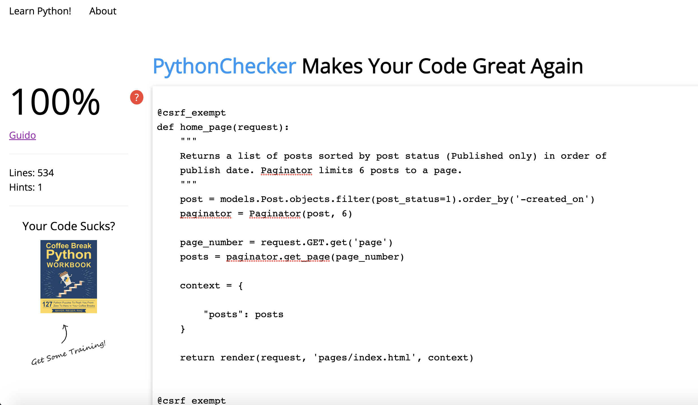
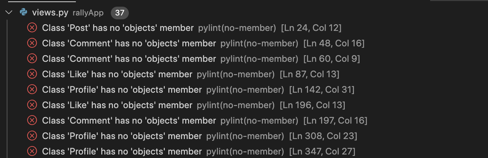

# Manual and Automated Testing 

This section comprises of Automated and Manual tests conducted towards the end of development of the website.

## Table of Contents:
1. [Manual Tests](#manual-tests)
2. [HTML Validation](#html-validation)
3. [CSS Validation](#css-validation)
4. [JS Validation](#js-validation)
5. [Python Validation](#python-validation)
6. [Lighthouse Performance](#lighthouse-performance-testing)
7. [Unresolved Issues](#current-issues-known-but-not-yet-resolved)

---

## Automated Tests:

`` USER STORY: As a Developer I can write code for automated tests in order to **accurately test my main code for bugs/issues and test criteria in order to refactor and test again.  ``

- Testing URL Resolution: All tests passed - see tests.py and run python3 manage.py test to run tests for yourself
- Due to time constraints and complexity of the project, I did not complete any further automated tests

---
## Manual Tests 

 ### Registration Form Submission (Register Page)

| Test | Method | Expected Outcome | Result |
| - | - | - | - |
| Registration Form | Try to submit empty form | Form doesn't submit, and points to first field not filled in | Pass |
| Registration Form | Try to submit a form where a username already exists | Username is taken message will appear and reload register page | Pass |
| Remember me check box | Click on check box more than once | Blue tick shows when it is selected | Pass |
| Remember me check box | Remember me check box selected, close site and revisit | User is kept signed in on return | Pass |
| Email input | Try to enter an invalid email address or random numbers, words etc. | Email invalid message appears | Pass |
| Forget Password Link | Click on link | User is redirected to Reset Password page | Pass |
| Login link | Click on link | User is redirected to Login Page | Pass |
| Registration Form | Create a new user | Success message displays as user is redirected to Login Page | Pass | 
- [User Story: Account Registration](https://github.com/Robrowno/rally-blog/issues/7)

&nbsp;

### Login Form Submission

| Test | Method | Expected Outcome | Result |
| ---- | ------ | ---------------- | ------ |
| Login Form | Submit empty form | Form doesn't submit, and points to first field not filled in | Pass |
| Login Form | Enter invalid Username | Return to login page with User not found message | Pass |
| Login Form | Enter User login credentials | Redirect to Home Page, logged in | Pass | 
| Remember me check box | Click on check box more than once | Blue tick shows when it is selected | Pass |
| Remember me check box | Remember me check box selected, close site and revisit | User is kept signed in on return | Pass |
| Forget Password Link | Click on link | User is redirected to Reset Password page | Pass |
| Login link | Click on link | User is redirected to Login Page | Pass | 
- [User Story: Login](https://github.com/Robrowno/rally-blog/issues/8)

&nbsp;
### Password Reset Form Submission

| Test | Method | Expected Outcome | Result |
| ---- | ------ | ---------------- | ------ |
| Form Submit | Test with false username | Return to Reset page with No user found message | Pass |
| Form Submit | Submit form with Username on file | Redirects with message stating an email has been sent  | Pass |
| Login link | Click on link | User is redirected to Login Page | Pass |
| Register link | Click on link | User is redirected to Register Page | Pass | 
- [User Story: Reset Password](https://github.com/Robrowno/rally-blog/issues/9)

&nbsp;
### Contact Form Submission

| Test | Method | Expected Outcome | Result |
| ---- | ------ | ---------------- | ------ |
| Form Submit | Attempt to submit empty form | Doesn't submit, points to first field not filled in | Pass |
| Form Submit | Attempt to submit with some but not all fields filled in | Specific fields not filled in inform the user that they are required | Pass |
| Form Submit | Submit a complete contact form | Form is sent and shows success message | Pass |
| Email input | Try to enter an invalid email address or random numbers, words etc. | Email invalid message appears | Pass | 
- [User Story: Contact Form](https://github.com/Robrowno/rally-blog/issues/13)

&nbsp;
### Comment Form Submission

| Test | Method | Expected Outcome | Result |
| ---- | ------ | ---------------- | ------ |
| Submit a Comment | Write a comment and click 'Submit' | When submit button is clicked, the post detail page reloads with new comment at the top of the comments section | Pass |
| Comments render | Read comments in comment section when post is submitted | Comment content should display, along with the user who posted and the date the comment was posted. | Pass |
| Comments Pagination | Create comment to test pagination number | When the pagination number is exceded, panigation will occur | Pass |
| Pagination Buttons | Click on all pagination buttons | Can traverse between pages to follow along with the conversation history | Pass | 
- [User Story: Comment](https://github.com/Robrowno/rally-blog/issues/12)

&nbsp;
---
## Updating 

### Update Profile

| Test | Method | Expected Outcome | Result |
| ---- | ------ | ---------------- | ------ |
| Attempt to submit form without changing anything | Submit form without making any changes | Profile will still save | Pass |
| Attempt to enter an invalid email | Enter an invalid email eg. 1234, abcd etc | Field will be invalid and form will not submit | Pass |
| Attempt to enter an email that already exists | Submit form with another user's email address | "Email is already taken" message will appear and form will not submit | Pass |
| Check updated field in the database | Visit admin page and check User section | Data will be updated in the database | Pass |
| Go back button | Click the "Go Back" Button | Return to the My-User Profile Page | Pass |
- [User Story: Update Profile](https://github.com/Robrowno/rally-blog/issues/27)

&nbsp;
### Update Comment

| Test | Method | Expected Outcome | Result |
| ---- | ------ | ---------------- | ------ |
| Edit Button | Click Edit Button | Input field and Update button will appear for User's comment | Pass |
| Edit input display | Check layout and input renders current comment | Layout is responsive and shows existing comment in the input field | Pass |
| Update Button | Click Update Button | Page Redirects with comment updated and success message | Pass |
| Read Edited comment | Check comment after update | Comment is now updated for all readers to see | Pass |
- [User Story: Edit Comment](https://github.com/Robrowno/rally-blog/issues/25)

&nbsp;
---
## Deleting 

### Deleting Comment

| Test | Method | Expected Outcome | Result |
| ---- | ------ | ---------------- | ------ |
| Delete Comment | Try to delete comment when not signed in | Not possible as only delete button available when Logged in | Pass |
| Delete Comment | Try to delete another user's comment | Not possible to delete another user's comment | Pass |
| Delete Comment | Delete your own comment | User Comment is removed | Pass |
| Comment counter (Delete) | Delete comment and view counter | Counter should subtract each time a comment is deleted | Pass |
- [User Story: Delete Comments](https://github.com/Robrowno/rally-blog/issues/26)

&nbsp;

### Delete Account

| Test | Method | Expected Outcome | Result |
| ---- | ------ | ---------------- | ------ |
| Delete Button | Click on Delete Button | Warning Modal will appear | Pass |
| Confirm Delete Button | Click on Confirm Delete Button | Account will delete, redirects to Home Page | Pass |
| Close Modal | Click Close Button or 'x' | Modal will close | Pass |
| Database Check | Check Admin Page to see if User is removed | User is deleted from the database | Pass |
- [User Story: Delete Account](https://github.com/Robrowno/rally-blog/issues/31)

&nbsp;
---
## Posts and Post-Details

### Post-List // Manage Page Post-List

| Test | Method | Expected Outcome | Result |
| ---- | ------ | ---------------- | ------ |
| Add Post (Add Post) | Add post from Admin page and/or Manage Page | Post is added to database and shows if post_status=1 | Pass |
| Delete Post (Manage Index) | Click delete on Manage or delete from admin page | Post is removed from front end post list and database | Pass |
| Edit Post (Edit Post Page) | Click edit and update from Manage Page or Edit post from Admin Page | Post updates on frontend and database | Pass |
| Draft Post | Select post_status=0 or draft in Manage Page | Post is saved but not published so you can work on it later | Pass |
| Required fields (Add Post) | Attempt to submit form various times without filling in required fields | Form will not submit and will point to the field not filled in | Pass |
| Post Shows when set to "Published" | Set post_status = 1 | When post_status = 1, post is set to "published" | Pass |
| Post hidden when set to "Draft" | Set post_status = 0 | When post_status = 0, post is set to "draft" | Pass |
- [User Story: Post Replication](https://github.com/Robrowno/rally-blog/issues/3)
- [User Story: Manage Panel](https://github.com/Robrowno/rally-blog/issues/28)
- [User Story: Create Drafts](https://github.com/Robrowno/rally-blog/issues/2)

&nbsp;
### Pagination

| Test | Method | Expected Outcome | Result |
| ---- | ------ | ---------------- | ------ |
| Pagination | Create 7 Blog Posts (Pagination number set to 6) | When number of Posts exceeds 6, pagination will occur | Pass |
| Left-Right Buttons | Click Left and Right Buttons on Paginator | Left button will move back one page, where as right button will move forward one page | Pass |
| Page Number Buttons | Click Page number buttons | Shows specific page number matching the number in the paginator | Pass |
- [User Story: Pagination](https://github.com/Robrowno/rally-blog/issues/4)
&nbsp;
### Post-Detail

| Test | Method | Expected Outcome | Result |
| ---- | ------ | ---------------- | ------ |
| Open Specific Post | Click on a Blog Post out of the Post List | Blog post will open  | Pass |
| Check Post details | Read Post Details | Specific Post details of the blog clicked-on will render on the page | Pass |
- [User Story: Open Post](https://github.com/Robrowno/rally-blog/issues/6)
&nbsp;

## Social Media Page and Footer Links:

### Social Media Page

| Test | Method | Expected Outcome | Result |
| ---- | ------ | ---------------- | ------ |
| Facebook Link/Icon | Click Link/Icon | Opens my Facebook Page in a new tab | Pass |
| Instagram Link/Icon | Click Link/Icon | Opens my Instagram Page in a new tab  | Pass |
| Github Link/Icon | Click Link/Icon | Opens my Github Page in a new tab  | Pass |
| Linkedin Link/Icon | Click Link/Icon | Opens my Linkedin Page in a new tab  | Pass |
- [User Story: Follow Page](https://github.com/Robrowno/rally-blog/issues/14)

&nbsp;

### Footer Icons

| Test | Method | Expected Outcome | Result |
| ---- | ------ | ---------------- | ------ |
| Facebook Link/Icon | Click Link/Icon | Opens my Facebook Page in a new tab  | Pass |
| Instagram Link/Icon | Click Link/Icon | Opens my Instagram Page in a new tab  | Pass |
| Github Link/Icon | Click Link/Icon | Opens my Github Page in a new tab  | Pass |
| Linkedin Link/Icon | Click Link/Icon | Opens my Linkedin Page in a new tab  | Pass |
- [User Story: Social Media](https://github.com/Robrowno/rally-blog/issues/5)

&nbsp;

---
## HTML Validation:
- HTML Validation by W3C was used to check my HTML code: [W3C Markup Validation Link](https://validator.w3.org/)
- Testing conducted across all HTML Templates. Results below:

### /templates and /templates/pages:

| File | Result |
| -------- | ------ |
| base.html  | Pass |
| index.html  | Pass |
| add-post.html  | Pass |
| contact.html  | Pass |
| edit-profile.html  | Pass |
| follow-me.html  | Pass |
| login.html  | Pass |
| manage-index.html  | Pass |
| manage-post.html  | Pass |
| my-profile.html  | Pass |
| post-detail.html  | Pass |
| register.html  | Pass |

### /templates/pages/accounts:

| File | Result |
| -------- | ------ |
| password_change.html  | Pass |
| password_reset.html  | Pass |

### /templates/pages/errors:

| File | Result |
| -------- | ------ |
| 403.html  | Pass |
| 404.html  | Pass |
| 405.html  | Pass |

CLICK TO OPEN/HIDE HTML VALIDATION IMAGES

### base.html and index.html

---
### post-detail.html

---
### add-post.html

---
### manage-post.html

---
### manage-index.html

---
### contact.html

---
### my-profile.html

---
### edit-profile.html

---
### follow-me.html

---
### login.html

---
### register.html

---
### password_change.html

---
### password_reset.html

---
### 403.html

---
### 404.html

---
### 500.html

---

### Current HTML Errors/Issues/Explanations"

- None to report.

---
## CSS Validation:
- CSS Validation by W3C was used to check my CSS: [W3C CSS Validation Link](https://jigsaw.w3.org/css-validator/)
- Testing conducted across all CSS files. Results below:

| File | Result |
| -------- | ------ |
| base.css  | Pass |
| contact.css  | Pass |
| follow.css  | Pass |
| index.css  | Pass |
| login.css  | Pass |
| post-detail.css  | Pass |

CLICK TO OPEN/HIDE CSS VALIDATION IMAGES

### base.css

---
### contact.css

---
### follow.css

---
### index.css

---
### login.css

---
### post-detail.css

---
### Current CSS Errors/Issues/Explanations"

- None to report.

---

## JS Validation:
- JS validation by JSHint was used to check my Javascript code: [JSHint Validation Link](https://jshint.com/)
- Results on Javascript code below:

| File | Result |
| -------- | ------ |
| base.js  | Pass* |
| index.js  | Pass |

CLICK TO OPEN/HIDE JS VALIDATION IMAGES

### base.js

---
### index.js

---

### Current JS Errors/Issues/Explanations"

- JSHint found an 'Undefinded Variable' in the form of 'e' in the base.js file, however, this is standard practice and I have found a supporting link to demonstrate this below.
- [W3 Schools: preventDefault() Event Method](https://www.w3schools.com/jsref/event_preventdefault.asp#:~:text=The%20preventDefault()%20method%20cancels,link%20from%20following%20the%20URL)

---
## Python Validation:
- At the time of writing/development of this project, the tried and tested PEP8 Python Validator was down. I mainly had to rely on the Linter that came with the Code Institute workspace that we use to start the portfolio projects. I did also use the https://www.pythonchecker.com/ site to test my code.
- Results across all pages with Python code below:

| File | Result |
| -------- | ------ |
| views.py  | Pass* |
| models.py  | Pass* |
| urls.py  | Pass |
| helpers.py  | Pass |
| forms.py  | Pass |
| tests.py  | Pass |

"*" -  This acknowledges and takes into account the known errors that come with the Gitpod Linter.

CLICK TO OPEN/HIDE PYTHON VALIDATION IMAGES

### Current Python Errors/Issues/Explanations"

- The Pylint and PEP8 checker on Gitpod is notoriously sensitive and flags warnings where they aren't necessary, see example below:
- 
- Pylint flags the 'token' argument as having no value, this is to be ignored as well, as per the SendGrid Documentation.
- Ignoring any errors caused by using keywords such as id, pk, e, etc, which flags due to either warning about not being in snake case, or being reassigned a new value.
- Import env issue in settings.py can be ignored
- Several docstring warnings for imports, which can be ignored
- The Password reset and change function's exceptions have to be passed with ``pass`` - otherwise the email password reset will not work. This is the same in helpers.py, where I have opted to ``print(e)`` instead. I trialled using message errors but it failed.

---
## Lighthouse Performance Testing:
- Lighthouse Testing was performed in an incognito tab to ensure no external chrome add-ons were affecting the test.
- Results of the Lighthouse Performance testing below:

## Tests on mulitple devices and browsers:
- Browsers tested:
    - Google Chrome
    - Safari

- Devices Tested on:
    - Apple Macbook Pro
    - Apple iPhone 12 Pro
    - Iphone X
    - HP laptop w/ Windows 11 installed
    - IPad Pro

---

## Current Issues known but not yet resolved:

- The responsiveness of the like and and comment icons on the blog cards in the post list aren't quite perfect. They will move inwards if a title is shorter than a certain number of characters. This will be addressed in a future update.
- The like counter can take some time to load occasionally. However, I believe this is more of a connection issue rather than anything to do with my code.
- In the Edit Post Management page, whilst using crisy forms, I am currently unable to render the current image link to the front end. When using `{{ form.as_p }}`, it seems to work perfectly, but then you lose the formatting that crispy forms provides. I will aim to address this in an update in future.
- Titles cannot be too long at the moment, because it disrupts the css on some screen sizes - this will be fixed in future updates
- Depending on resolution of images and wifi connectivity, speed of site loading can vary greatly.

### Return to README: 

[README.md](README.md)

